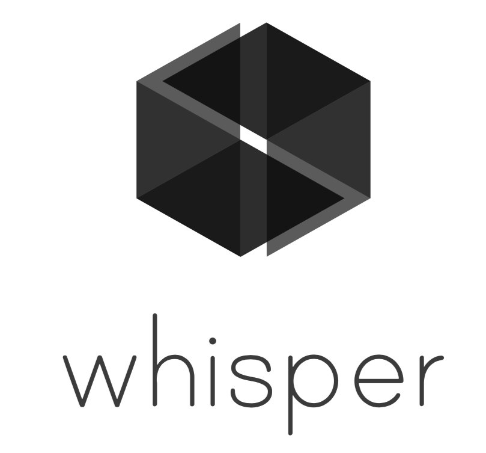

# Whisper subprotocol 

This repository gathers various whisper-related tools

## Contents

- [Whisper SubProtocol](#whisper-subprotocol)
  - [Implementations](#implementations)
  - [Specifications / White Papers](#specifications--white-papers)
  - [wiki guides](#wiki--gides)
- [Applications](#applications)
  - [Desktop Interfaces](#desktop-interfaces)
  - [Explorers](#explorers)
  - [Misc](#misc)
- [Developer Resources](#developer-resources)
  - [Libraries](#libraries)
  - [Tutorials](#tutorials)
  - [Example Projects](#example-projects)
- [Learning Resources](#learning-resources)
  - [Talks](#talks)
  - [Books](#books)
- [Community](#community)
  - [Telegram](#telegram)
- [Contribute](#contribute)
- [License](#license)

## Whisper SubProtocol

### Implementations

Implementations of the Whisper subprotocol

### Specifications / White Papers

- [EIP-627: Whisper Specification](https://github.com/ethereum/EIPs/blob/master/EIPS/eip-627.md)

- [Formal spec](https://github.com/ethereum/whisper/spec/WHISPER.md)

### Wiki guides

- [Whisper wiki](https://github.com/ethereum/go-ethereum/wiki/Whisper)

- [Whisper Overview](https://github.com/ethereum/go-ethereum/wiki/Whisper-Overview)

- [Whisper web3.js API](http://web3js.readthedocs.io/en/1.0/web3-shh.html)

- [Whisper RPC API 6.0](https://github.com/ethereum/go-ethereum/wiki/Whisper-v6-RPC-API)

- [Diagnostic Tool: wnode](https://github.com/ethereum/go-ethereum/wiki/Diagnostic-Tool-wnode)

- [Achiving Darkness](https://github.com/ethereum/go-ethereum/wiki/Achieving-Darkness)

- [Javascript Examples](https://github.com/ethereum/go-ethereum/wiki/Whisper-js-example)

## Applications

### Standalone Interfaces

- [wnode - geth](https://github.com/ethereum/go-ethereum/wiki/Diagnostic-Tool-wnode)

- [whisper-cli - paritytech](https://github.com/paritytech/parity-ethereum/tree/master/whisper)

### Explorers

### Misc

- [Releasing Wireshark dissectors for Ethereum ÐΞVp2p protocols” by Raúl Kripalani](https://link.medium.com/B9kv1w4juT)

## Developer Resources

### Libraries

- [web3.js - shh](https://web3js.readthedocs.io/en/1.0/web3-shh.html)

### Tutorials

- [Whisper — Shh! - CaelumL abs](https://medium.com/caelumlabs/whisper-shh-bc5416ec0046)

- [Introducing Bloom Payment Channels Enabled By Ethereum Whisper](https://blog.hellobloom.io/introducing-bloom-payment-channels-enabled-by-ethereum-whisper-1fec8ba10a03)

- [Embark into Whisper - making gossip easy - status.im](https://status.im/tutorials/whisper_embark.html)

- [Whisper in your CLI - status.im](https://status.im/tutorials/whisper_basic_cli.html)

### Example Projects

- [Decentralized Application Messaging with Whisper](https://blog.enuma.io/update/2018/08/08/decentralized-application-messaging-with-whisper.html)

## Learning Resources

### Talks

- [DevCon 0: Whisper: the Multi DHT Messaging System with routing Privacy  - Gavin Wood](https://www.youtube.com/watch?v=BrWlAtfqF6s)

- [DEVCON1: SHH! Whisper - Gavin Wood](https://www.youtube.com/watch?v=lCA4BARxUUY)

- [State of Whisper - Guilaume Ballet](https://www.youtube.com/watch?v=NiKY41ED9-0)

- [Whisper: Achieving Darkness - Vlad Gluhovsky](https://www.youtube.com/watch?v=koZizelOUeI)

### Blogs

- [Whisper - PSS comparison - Status.im ](https://our.status.im/whisper-pss-comparison/)

## Community

### Fellowship of Ethereum Magicians

- [WhiSpeG](https://ethereum-magicians.org/search?q=whispeg)

### Telegram

- [Whisper Specification Group]()

## Contribute

Contributions welcome! Read the [contribution guidelines](contributing.md) first.

## License

To the extent possible under law, the author has waived all copyright and
related or neighboring rights to this work.

